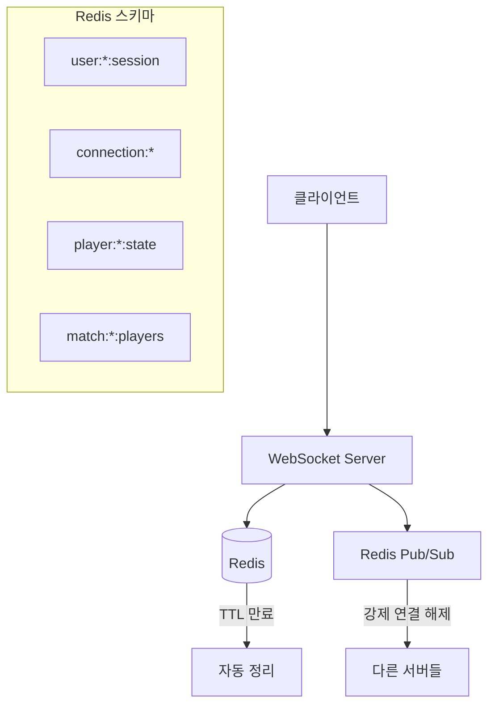

# Redis 기반 연결 상태 관리 시스템

> **실시간 멀티플레이어 게임을 위한 강화된 연결 관리 아키텍처**

## 📋 개요

이 문서는 dogfight-raycast-demo 프로젝트에 구현된 Redis 기반 연결 상태 관리 시스템에 대해 설명합니다. 기존의 메모리 기반 연결 관리의 한계를 극복하고, 네트워크 장애 및 재연결 시나리오에 강건한 시스템을 구축했습니다.

## 🎯 해결한 문제들

### 기존 문제점
- **스테일 연결 문제**: 네트워크 장애 시 서버에서 연결 해제를 감지하지 못함
- **재연결 제한**: 동일 사용자의 재연결 시도가 차단됨
- **서버 재시작 취약성**: 서버 재시작 시 모든 연결 정보 손실
- **멀티 서버 미지원**: 여러 서버 인스턴스 간 상태 공유 불가

### 해결 방안
- **Redis TTL 기반 자동 정리**: 연결 상태 자동 만료 및 정리
- **강제 재연결 허용**: 기존 연결 강제 종료 후 새 연결 허용
- **Redis Pub/Sub**: 멀티 서버 간 강제 연결 해제 통신
- **영속적 세션 관리**: 서버 재시작에도 세션 정보 유지

## 🏗️ 시스템 아키텍처



## 📊 Redis 스키마 구조

### 1. 사용자 세션 (`user:{userId}:session`)
```redis
user:42:session = {
  playerId: "123",
  username: "Player1", 
  matchId: "456",
  serverId: "server-1",
  connectedAt: "1703123456789",
  lastActivity: "1703123456789",
  status: "connected"
}
TTL: 5분 (300초)
```

### 2. 연결 정보 (`connection:{playerId}`)
```redis
connection:123 = {
  wsId: "uuid-12345-67890",
  serverId: "server-1",
  timestamp: "1703123456789"
}
TTL: 2분 (120초)
```

### 3. 플레이어 상태 (`player:{playerId}:state`)
```redis
player:123:state = {
  position: "[0, 10, 0]",
  rotation: "[0, 0, 0, 1]",
  health: "100",
  speed: "50",
  lastUpdate: "1703123456789"
}
TTL: 10분 (600초)
```

### 4. 매치 플레이어 목록 (`match:{matchId}:players`)
```redis
match:456:players = {123, 124, 125}  # Set 타입
TTL: 1시간 (3600초)
```

## 🔄 재연결 시나리오 처리

### 시나리오 1: 사용자가 이미 접속 중인 상태에서 재연결
```javascript
// 상황: 네트워크 장애로 클라이언트 연결만 끊어짐
// 서버는 아직 기존 연결을 유지 중

const existingConnection = await redisClient.hgetall(`connection:${playerId}`);

if (existingConnection.wsId) {
  // 1. 기존 연결 강제 종료 요청 (Pub/Sub)
  await forceDisconnectPlayer(playerId, existingConnection.wsId, 'New connection');
  
  // 2. Redis 상태 정리
  await redisClient.del(`connection:${playerId}`);
  
  // 3. 메모리 상태 정리
  players.delete(playerId);
  activeConnections.delete(playerId);
  
  // 4. 새 연결 허용
  console.log('🔄 Reconnection allowed');
}
```

### 시나리오 2: 사용자가 접속하지 않은 상태에서 연결
```javascript
// 상황: 정상적인 새 연결 시도
// Redis에 기존 연결 정보가 없음

if (!existingConnection.wsId) {
  // 정상적인 새 연결 처리
  console.log('✅ New connection established');
}
```

## 🛠️ 핵심 구현 함수들

### 1. 연결 상태 설정
```javascript
async function setPlayerConnectionState(playerId, userId, username, matchId, wsId) {
  const now = Date.now();
  await Promise.all([
    // 연결 정보 저장
    redisClient.hmset(`connection:${playerId}`, {
      wsId, serverId: SERVER_ID, timestamp: now
    }),
    redisClient.expire(`connection:${playerId}`, 120),
    
    // 세션 정보 저장
    redisClient.hmset(`user:${userId}:session`, {
      playerId, username, matchId: matchId || '',
      serverId: SERVER_ID, connectedAt: now,
      lastActivity: now, status: 'connected'
    }),
    redisClient.expire(`user:${userId}:session`, 300),
    
    // 매치 플레이어 목록 추가
    matchId ? redisClient.sadd(`match:${matchId}:players`, playerId) : Promise.resolve()
  ]);
}
```

### 2. 활동 상태 업데이트
```javascript
async function updatePlayerActivity(playerId, userId) {
  const now = Date.now();
  await Promise.all([
    redisClient.hset(`user:${userId}:session`, 'lastActivity', now),
    redisClient.expire(`user:${userId}:session`, 300),
    redisClient.expire(`connection:${playerId}`, 120)
  ]);
}
```

### 3. 강제 연결 해제
```javascript
async function forceDisconnectPlayer(playerId, oldWsId, reason) {
  // Redis Pub/Sub로 모든 서버에 강제 연결 해제 요청
  await redisPubSub.publish('force_disconnect', JSON.stringify({
    playerId, oldWsId, serverId: SERVER_ID, reason
  }));
}
```

### 4. 연결 상태 정리
```javascript
async function clearPlayerConnectionState(playerId, userId, matchId) {
  await Promise.all([
    redisClient.del(`connection:${playerId}`),
    redisClient.hset(`user:${userId}:session`, 'status', 'disconnected'),
    matchId ? redisClient.srem(`match:${matchId}:players`, playerId) : Promise.resolve(),
    redisClient.del(`player:${playerId}:state`)
  ]);
}
```

## 🔧 개발 도구 및 디버깅

### Node.js 콘솔에서 사용 가능한 디버그 함수들

```javascript
// 활성 플레이어 목록 조회 (테이블 형태로 출력)
await debugRedis.getActivePlayers()

// 특정 플레이어의 전체 상태 조회
await debugRedis.getPlayerState(123)

// 매치의 플레이어 목록 조회
await debugRedis.getMatchPlayers(456)

// Redis 전체 상태 정리 (개발용)
await debugRedis.cleanupRedis()
```

### 자동 모니터링 (개발 모드)
```bash
# 5분마다 자동으로 Redis 상태 로깅
📊 Redis State - Sessions: 2, Connections: 2, Matches: 1
🔗 Active sessions:
   user:123:session: Player1 (connected) - Match: 1
   user:124:session: Player2 (connected) - Match: 1
```

## 🚀 실행 및 테스트

### 1. 서버 시작
```bash
cd server
NODE_ENV=development npm run dev
```

### 2. Redis 설정 확인
```bash
# Redis 서버 실행 여부 확인
redis-cli ping

# Redis 키 확인
redis-cli keys "*"
```

### 3. 재연결 테스트
```javascript
// 동일한 username으로 여러 번 연결 시도
// 기존 연결이 자동으로 해제되고 새 연결이 허용되는지 확인

const ws1 = new WebSocket('ws://localhost:3000?username=testuser');
// 잠시 후...
const ws2 = new WebSocket('ws://localhost:3000?username=testuser');
// → ws1이 자동으로 해제되고 ws2가 연결됨
```

## 📈 성능 최적화

### TTL 설정 근거
- **Connection (2분)**: WebSocket 연결의 빠른 감지를 위해 짧게 설정
- **Session (5분)**: 사용자 인증 정보의 적절한 유지 시간
- **Player State (10분)**: 게임 상태의 충분한 보존 시간
- **Match Players (1시간)**: 매치 진행 중 안정성 보장

### 논블로킹 처리
```javascript
// Redis 작업을 논블로킹으로 처리하여 게임 성능 영향 최소화
try {
  await redisClient.hmset(`player:${playerId}:state`, playerState);
} catch (error) {
  console.error('Redis error (non-blocking):', error);
  // 게임은 계속 진행
}
```

## 🔍 트러블슈팅

### 일반적인 문제들

#### 1. Redis 연결 실패
```bash
# Redis 서버 상태 확인
sudo systemctl status redis
# 또는
brew services restart redis
```

#### 2. 세션이 계속 만료됨
```javascript
// TTL 시간 확인
await redisClient.ttl('user:123:session')

// 활동 업데이트가 정상 작동하는지 확인
console.log('Activity update:', await updatePlayerActivity(playerId, userId));
```

#### 3. 강제 연결 해제가 작동하지 않음
```javascript
// Pub/Sub 구독 상태 확인
redis-cli pubsub channels

// 메시지 발행 테스트
redis-cli publish force_disconnect '{"test": true}'
```

#### 4. 메모리 사용량 증가
```bash
# Redis 메모리 사용량 확인
redis-cli info memory

# 만료된 키들이 정리되고 있는지 확인
redis-cli info keyspace
```

## 🎯 다음 단계

### 가능한 개선사항
1. **Redis Cluster**: 고가용성을 위한 Redis 클러스터 구성
2. **Connection Pooling**: Redis 연결 풀 최적화
3. **Metrics**: Prometheus + Grafana를 통한 메트릭 수집
4. **Rate Limiting**: Redis를 활용한 연결 속도 제한
5. **Session Recovery**: 네트워크 복구 시 세션 자동 복원

### 모니터링 고도화
```javascript
// 추가 가능한 메트릭들
- 초당 연결/해제 수
- 평균 세션 지속 시간  
- 강제 연결 해제 빈도
- Redis 응답 시간
```

---

## 📚 관련 문서

- [System Overview](./System-overview.md) - 전체 시스템 아키텍처
- [Development Resources](./development-resources.md) - 개발 환경 설정
- [Server README](../server/README.md) - 서버 설정 및 실행 방법

---

**✅ 이제 dogfight-raycast-demo는 네트워크 장애에도 끊어지지 않는 강력한 연결 관리 시스템을 갖추었습니다!** 🎮🚀 